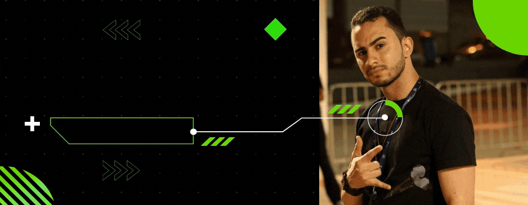

<!-- Cover -->

	

## Olá, tudo bem? &#129311;&#127995;

👨🏻‍💻 Me chamo **Jeferson Lucas**, tenho 26 anos, sou formado em Análise e Desenvolvimento de Sistemas, apaixonado pela tecnologia, música, games e estou focado na área de **Desenvolvimento Front-end**.

👨🏻‍🎓 Estou cursando Desenvolvimento Front-end através de um Bootcamp oferecido pelo *Instituto de Gestão e Tecnologia da Informação* - [IGTI](https://www.igti.com.br/) além de outros cursos especializados. Estou desenvolvendo aplicações utilizando as tecnologias: **React**, **Angular**, **Vue.js**, **Node.js**, **TypeScript** e **MongoDB**.

## Sobre &#129492;&#127995;
<!-- Social Networks -->
&nbsp;

&nbsp;
&nbsp;
&nbsp;
&nbsp;
&nbsp;

<!-- Info repo -->
&nbsp;
&nbsp;
&nbsp;
&nbsp;
&nbsp;
&nbsp;
&nbsp;
&nbsp;
&nbsp;

<!-- GitHub Stats -->
 

## Habilidades 👨🏻‍💻
<!-- Languages, libs and frameworks -->
&nbsp;
&nbsp;
&nbsp;
&nbsp;
&nbsp;
&nbsp;
&nbsp;
&nbsp;
&nbsp;
&nbsp;
&nbsp;
&nbsp;
&nbsp;
<!-- Tools Front-end -->
&nbsp;
&nbsp;
&nbsp;
&nbsp;
&nbsp;
&nbsp;
&nbsp;

<!-- Skills -->
Estão aqui algumas das minhas habilidades e conhecimentos como Desenvolvedor Front-end:
- 💻 **Front-end**: HTML, CSS (Media Query, Animation, Flexbox, Grid, Sass), JavaScript (Ajax, jQuery, ES6+), Bootstrap, Angular 4+, React.
- 🔠 **Linguagens**: HTML/CSS, JavaScript, ES6+, TypeScript.
- 🏷️ **Versionamento**: Git.
- 🧪 **Testes e automatização**: NPM, Jimp, Gulp.
- 🎲 **Banco de Dados**: Linguagem SQL, Modelagem de dados, MySQL.
- 🏗️ **Infraestrutura**: HTTP, Windows 10.
- 👷🏻 **Arquitetura**: Rest, Orientação a Objetos.
- 📈 **Engenharia de Software**: Levantamento de requisitos, UML, Scrum e Kanbam.

<!-- Projects -->
## Projetos 📦

Meus top 3 projetos: 🏆
1. 🥉 [Snake Game 2D](https://github.com/JefersonLucas/snake-game-2D) - O famoso jogo de Scobra em 2D no qual o seu objetivo é comer, ficar enorme e acumular muitos pontos.
2. 🥈 [The Sharingan Eye](https://github.com/JefersonLucas/the-sharingan-eye) - O poderoso dojutsu kekkei genkai dos membros do clã Uchiha feito em CSS.
3. 🥇 [The Matrix Effect](https://github.com/JefersonLucas/the-matrix-effect) - O incrível efeito de chuva de letras da triologia Matrix.