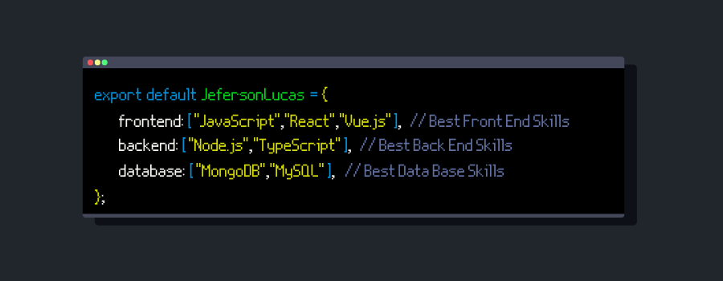

<!-- Cover -->

	

<!-- Info repo -->

## Hello how are you? 🤟🏻🧔🏻

<!-- Social Networks -->

	
	
	
	
	
	
	
	
	
	

👨🏻‍💻 My name is **Jeferson Lucas**, I'm 26 years old, I'm Brazilian and graduated in Systems Analysis and Development, passionate about technology, music, games and I'm focused on **Full Stack Development**.

Recently completed a bootcamp aimed at the full stack, I am looking forward to sharing my knowledge in this repository.

<!-- GitHub Stats -->

<!-- Skills -->

## Skills 👨🏻‍💻

<!-- Languages, libs and frameworks -->

Some of the technologies you can find in my GitHub repository:

- 🔠 **Languages**: HTML, CSS, JavaScript, TypeScript and Sass.
- 🔜 **Frontend**: React, Next.js and Vue.js.
- 🔙 **Backend**: Node.js.
- 🧰 **Frameworks**: Bootstrap, Tailwind, Express and Mongoose.
- 🚀 **Deploys**: Heroku, Vercel and GitHub.
- 🏷️ **Versioning**: Git and gitflow.
- 🧪 **Testing and automation**: Jest and Gulp.
- 🎲 **Database**: MySQL and MongoDB.
- 🏗️ **Operational systems**: Windows 10 and Linux.
- 👷🏻 **Code architecture**: Object orientation, Rest, Flux and MVC.
- 📈 **Software Engineering**: Requirements gathering, UML, Scrum and Kanbam.

<!-- Projects -->

## Projects 📊

My top 3 most famous projects:🏆

- 🥇 [The Matrix Effect](https://github.com/JefersonLucas/the-matrix-effect) · The incredible rain effect of letters from the Matrix trilogy.
- 🥈 [The Sharingan Eye](https://github.com/JefersonLucas/the-sharingan-eye) · The powerful dojutsu kekkei genkai of the members of the Uchiha clan made in CSS.
- 🥉 [Snake Game 2D](https://github.com/JefersonLucas/snake-game-2D) · The famous 2D Scobra game in which your objective is to eat, get huge and accumulate many points.

You can also view all of my repositories [here](https://github.com/JefersonLucas?tab=repositories&q=&type=source&language=).
